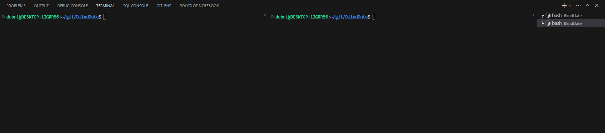

# Semester 6 - Blind Date Project

A social media platform optimized for accessability and ease of use for visually impaired people.

# Requirements

## Development environment

This project was meant to run on a Linux enviroment. While we would like to be able to have a full compatibility between Windows and Linux, we do not think that it is feasible to achive in a easily transferable project form. For that reason we encourage the following groups to use <a href="https://learn.microsoft.com/en-us/windows/wsl/install">WSL 2</a> on their Windows machines.

---

### WSL Setup

Setup steps are taken from the Microsoft Documentation <a href="https://learn.microsoft.com/en-us/windows/wsl/install">here</a>

First launch CMD with administrative priveleges and then run the following command.

```sh
wsl --install -d Ubuntu
```

This will install Ubuntu on your local machine.

After which you want to set it as your default WSL distro with the following command.

```sh
wsl --setdefault Ubuntu
```

You want to ensure that you are using WSL 2 instead of 1 (This is important), so run the following command

```sh
wsl --set-version Ubuntu 2
```

And with that you have properly installed Ubuntu on your Windows machine.

---

### Docker

For Docker you want to have Docker Desktop installed on your machine.

From there you want to go to Settings > General and enable `Use WSL 2 Engine`.

After that go to General > Resources > WSL Integrations and enable the integration for Ubuntu.

---

### Ubuntu Distro

You can access the WSL distro through either launching the Ubuntu terminal or typing `wsl` into CMD

There will be 3 main packages you need to install

- NVM - Node version manager
- Yarn - essentially npm but better
- Krakend - Api gateway

To install them run the following commands

```
sudo apt update && sudo apt upgrade
```

```
sudo apt-get install build-essential
```

Install Nvm

```
curl -o- https://raw.githubusercontent.com/nvm-sh/nvm/v0.39.1/install.sh | bash
source ~/.bashrc
nvm install 18
nvm alias default 18
```

Install Yarn

```
npm install --global yarn
```

Lastly to install Krakend you need to run the following command as a sudo user.

```
sudo su
```

```
apt install -y ca-certificates gnupg
apt-key adv --keyserver keyserver.ubuntu.com --recv 5DE6FD698AD6FDD2
echo "deb https://repo.krakend.io/apt stable main" | tee /etc/apt/sources.list.d/krakend.list
apt-get update
apt-get install -y krakend
```

This is the only way to install the gateway for now locally, check if that changes in the future. The download link is here. https://www.krakend.io/download/#

# Project Related Information

## S3 bucket setup

### Required libraries:

Multer: https://www.npmjs.com/package/multer

AWS S3 Client: https://docs.aws.amazon.com/AWSJavaScriptSDK/v3/latest/clients/client-s3/index.html

S3 request presigner: https://docs.aws.amazon.com/AWSJavaScriptSDK/v3/latest/modules/_aws_sdk_s3_request_presigner.html

### Bucket and user creation:

In order to create an S3 image/file bucket you need to have an AWS account. The requirements for it are to have a valid credit/debit card and they will debit 1 dollar to approve your AWS account. After that, you can easily create a bucket following the instructions in the S3 section. After successful bucket creation, you need to create a user. From the IAM section, you can easily create a user, again follow the instructions and default settings, but you need to set permission policies. You can easily give preset S3 permission to the user. After that, you need to get those 4 variables: 

S3_BUCKET_NAME,

S3_BUCKET_REGION,

S3_ACCESS_KEY (From the created user),

S3_SECRET_ACCESS_KEY (From the created user) and put them in the GitHub secrets or/and env file in the project. 

After that, everything should be ready and the creation and retrieval of the images should be working. 


## Installing the Project

To install clone the repo and run

```
yarn install && yarn build
```

---

## Running the Project

To run the project you have 3 options available

- Locally (Best for development)
- Docker compose
- Kubernets

### Running it Locally

The easiest way to run the project is to open a split terminal in VSCode



And running all the microservices and front-end from `./apps` with:

```
yarn dev
```

And running the Krakend API Gateway with:

```
yarn proxy
```

---

### Running it on Docker

To run the project on Docker simply run:

```
docker compose up
```

---

### Running it on Kubernetes

= Need to add instructions

---

## Repository structure

The repository is comprised of NodeJS applications, making the whole repository entirely javascript-based.

### Turborepo

It utilizes Turborepo, a high-performance build system for Javascript and Typescript projects. Turborepo allows for cached builds and dependecy sharing between applications, as well as local packages that do not require versioning and/or publishing to npm to use.

_Local packages can be found in the `./packages` directory._

---

## Techstack

- NextJS
- Krakend
  - Authentication - Through Auth0
- ExpressJS
- Prisma
- MongoDB
